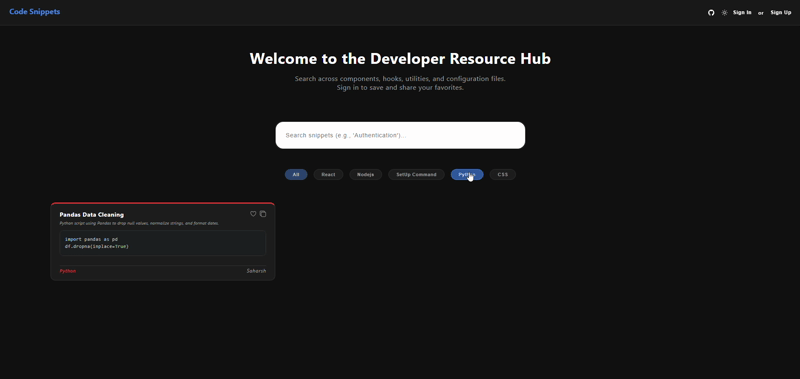

# Code Snippet Frontend

A responsive, React-based client interface for managing, searching, and categorizing developer code snippets. It features a custom dark/light theme toggle, secure authentication flows, and dynamic syntax highlighting for various programming languages.



---

### Prerequisites
Make sure you have Node.js and npm installed. You will also need to ensure the backend API service is running locally or accessible via a hosted URL.

## Getting Started

### Installation

1. Clone the repository:
```bash
git clone https://github.com/saharshbhatnagar/code-snippet-frontend.git
```

2. Navigate to the project directory:

```Bash
cd code-snippet-frontend
```

3. Install dependencies:

```Bash
npm install
```

4. Create your environment file:

    Create a `.env` file in the root directory and add your backend API URL:

    ```Bash
    VITE_API_URL=http://localhost:5000
    ```

    > Note: In a production AWS environment, this URL should point to your live `EC2 backend endpoint or domain`.

5. Start the development server:

```Bash
npm run dev
```

## Usage

### Production Build

1. Compile the React code using Vite:

```Bash
npm run build
```

2. Preview the production build locally:

```Bash
npm run preview
```

### Directory Structure

```Plaintext
code-snippet-frontend/
├── src/
│   ├── components/
│   │   ├── ConfirmModal.jsx
│   │   ├── CreateSnippet.jsx
│   │   ├── Navbar.jsx
│   │   ├── Popup.jsx
│   │   ├── SnippetCard.jsx
│   │   └── SnippetModal.jsx
│   ├── pages/
│   │   ├── Auth.jsx
│   │   ├── Dashboard.jsx
│   │   ├── Landing.jsx
│   │   └── ResetPassword.jsx
│   ├── services/
│   │   ├── apiClient.js
│   │   ├── authService.js
│   │   └── searchService.js
│   ├── styles/
│   │   ├── base.css
│   │   ├── components.css
│   │   ├── layout.css
│   │   └── signin-and-signup.css
│   ├── utils/
│   │   ├── sanitizer.js
│   ├── App.jsx
│   └── main.jsx
├── .gitignore
├── index.html
├── package.json
└── vite.config.js
```

## Additional Documentation

### Architecture Notes:

> The frontend is bundled using Vite for rapid development and optimized production builds. State management is handled natively via React Hooks, with API calls isolated in dedicated service files (`searchService.js`, `authService.js`) to ensure clean component logic.

**Tech Stack:** React, JavaScript, CSS, HTML, Vite, AWS Amplify

**Included packages:** react-router-dom, react-icons, react-syntax-highlighter, dompurify

### Full Architecture Stack

This frontend interface is one component of a complete cloud-native ecosystem. You can explore the backend microservice here:

Backend: [Code Snippet Backend Repo](https://github.com/saharshbhatnagar/code-snippet-backend.git)